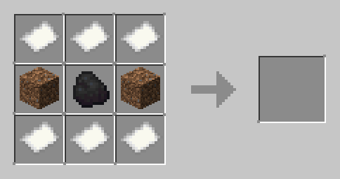
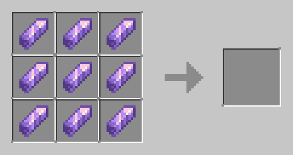
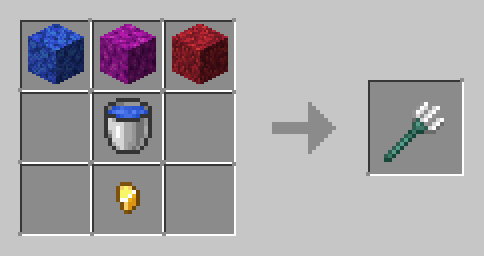

# Minecraft But you Can eat Biomes

This is the Minecraft map made for [Capitaine Kirk](https://www.youtube.com/@CapitaineKirk)

### Featues

- Custom Map
- Custom Sturctures
- Custom Mobs
- New Items
- Edible Bioms
- Custom Powers
- Progression based Gameplay

### How to Download

1. Download the `world [extract].zip` and `resourcepack.zip` file
1. Extract the `world [extract].zip` file
1. copy the `world` folder to your `.minecraft/saves` folder
1. Copy the `resourcepack.zip` file to your `.minecraft/resourcepack` folder
1. These Fabric Mods must be used as a dependency.
    - https://modrinth.com/mod/fabrictailor
    - https://modrinth.com/mod/entitytexturefeatures
    - https://modrinth.com/mod/pehkui
    - https://modrinth.com/mod/friends-and-foes
1. It is also recommended to use [Sildurs Vibrant Shaders.](https://sildurs-shaders.github.io/downloads/)

### How to play

- Just join the world.
- Run these commands.
```elixir
/tag @s remove dpc.load
/reload
```


### Important Crafting recepies

<details>
<summary>Atlas</summary>


</details>

<details>
<summary>Lush Fork Handle</summary>


</details>

<details>
<summary>Ocean Fork</summary>


</details>

**Other Forks**
```
A A A
_ B _
_ C _
```
In a crafting table place the items in the above pattern and select the items based on the list provided below.
in all these cases `C` will be the fork handle of the respective biome.

| Biome        | A              | B               |
|--------------|----------------|-----------------|
| Desert       | sand           | sandstone       |
| Jungle       | jungle log     | Vines           |
| Lush Caves   | Moss Block     | Glow Berries    |
| Mushroom     | red mushroom   | brown mushroom  |
| Tiaga        | spruce leaves  | Spruce log      |
| Ice          | Packed Ice     | Snow Block      |


## Tips and trick

<details>
<summary>Plains biome</summary>

you will be given a Plains fork. Right-click it to eat the biome.
</details>

<details>
<summary>Desert Biome</summary>

The atlas will lead you to the desert temple. Explode its TNT to get the fork handle.
</details>

<details>
<summary>Tiaga Biome</summary>

You have to use a shovel to put out all the campfires in the Tiaga village
</details>

<details>
<summary>Lush Caves</summary>

Find the Amethyst geode.
</details>

<details>
<summary>Jungle</summary>

Fight the Kong mini-boss to clear this level
</details>

<details>
<summary>Mountain</summary>

Kill the Ice-Illager Boss to complete this level
</details>

<details>
<summary>Ocean</summary>

Find the Pirate Ship and kill all its Pirates.
</details>

<details>
<summary>Mushroom island</summary>

Use Shears to remove fungus from cows
</details>

<details>
<summary>Ice Spikes</summary>

This will be the final boss fight
Make sure not to damage the nearby area because it won't look good.
First, destroy the 3 crystals near the Alchemy Circle on top of the tall pillars
Then use the Fork to eat the biome(please go underground don't damage the top land)
After that, it's wait and watch.
make sure to watch the Boss from a little far away

The rest will be done automatically
</details>


## Gallery

Image and a Video Clip from the final boss fight


https://github.com/Bittu5134/random/assets/89441005/a72e4976-359c-46e8-aa44-1066fe4e1c9f


